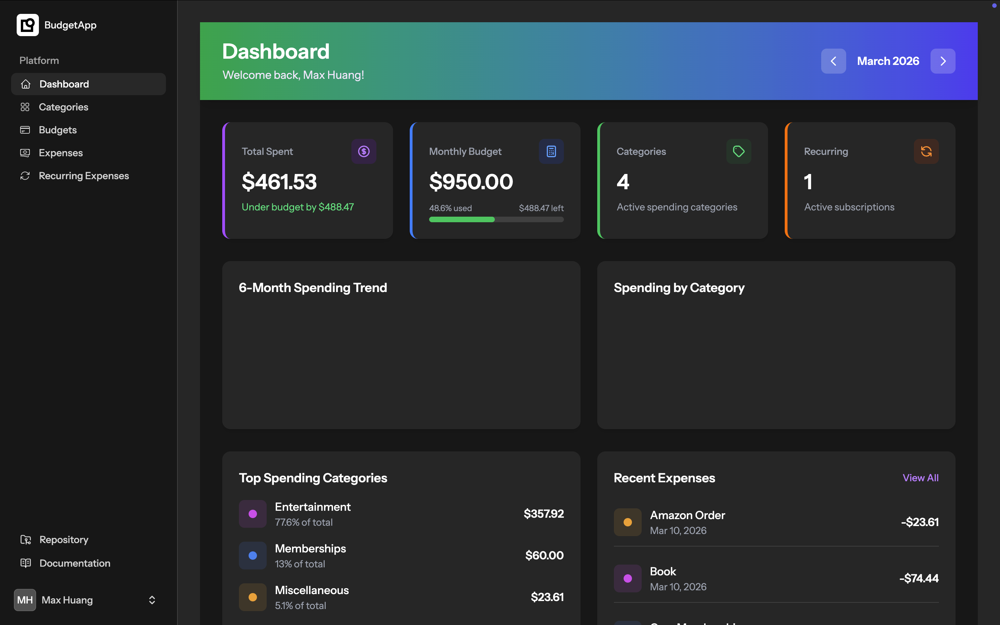
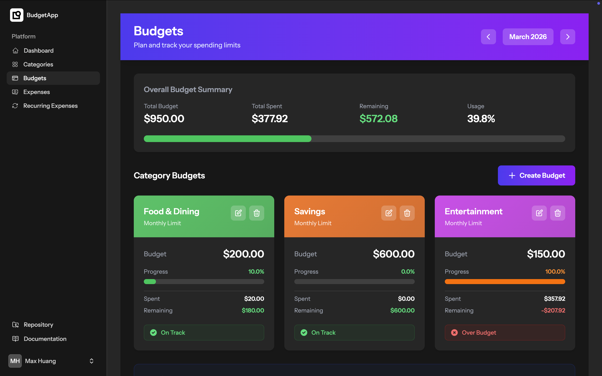
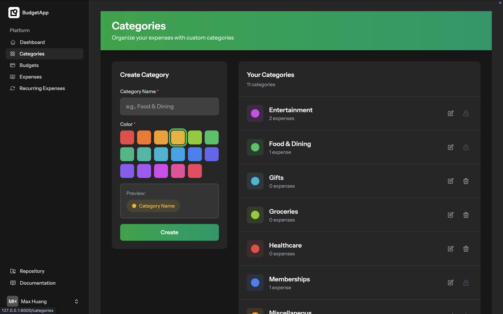
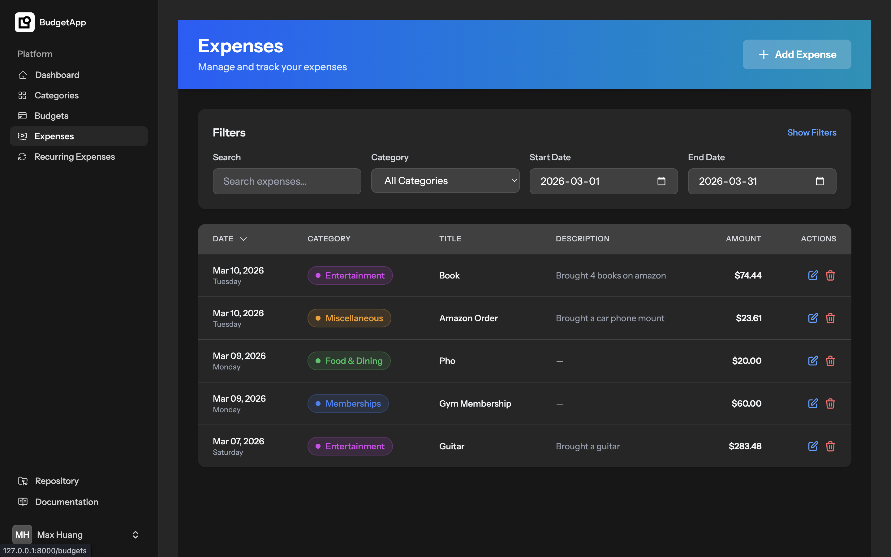
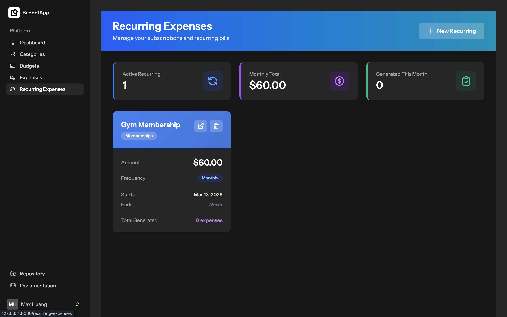

# 💰 Smart Expense Tracking App

A modern, full-stack expense tracking application built with the TALL stack (Tailwind CSS, Alpine.js, Laravel, Livewire) and integrated with Google Gemini AI for smart budget recommendations. This application helps users manage their finances, track recurring expenses, and visualize their spending patterns with real-time updates.

*Developed based on the tutorial by [code with SJM](https://www.youtube.com/watch?v=KOHBYzDoGXU).*

---

## ✨ Features

* **📊 Interactive Dashboard:** Visualize your spending patterns with beautiful charts, line graphs, and real-time statistics without needing to refresh the page.
* **🤖 AI Smart Recommendations:** Integrated with Google Gemini AI. The AI analyzes your previous 3 months of spending history for a specific category and suggests realistic budget amounts (Conservative, Recommended, and Comfortable) along with reasoning.
* **🔁 Recurring Expenses:** Automate your fixed expenses (e.g., Netflix subscriptions, rent) with customizable frequencies (daily, weekly, monthly, yearly).
* **🗂️ Custom Categories:** Categorize budgets and expenses. Users can create custom categories with tailored colors and icons.
* **🎯 Budget Management:** Create overall and category-specific budgets. Visual progress bars track usage and remaining funds.
* **🔔 Email Notifications:** Receive automated email alerts when your spending exceeds your allocated budget.
* **📱 Fully Responsive & Dark Mode:** Accessible on mobile, tablet, and desktop devices. Features built-in toggles for Light and Dark modes.
* **🔐 Advanced Security:** Built-in authentication featuring profile management, password updates, and Two-Factor Authentication (2FA).

---

## 🛠️ Tech Stack

This project utilizes the **TALL** Stack along with external APIs for its core functionality:
* **Framework:** Laravel
* **Frontend Reactive Components:** Livewire & Flux UI
* **JavaScript Framework:** Alpine.js
* **Styling:** Tailwind CSS
* **Database:** MySQL
* **AI Integration:** Google Gemini PHP Laravel Official Package 
* **Local Server Environment:** XAMPP (Apache/MySQL) or Laravel Herd/Valet

### Start the Development Server

To run the application locally, you will need to start your database, frontend assets, and backend server:

**A. Start XAMPP Database**
Open your XAMPP Control Panel and start both the **Apache** and **MySQL** modules.

**B. Start the Vite Development Server**
Open a new terminal window or tab in your project directory and run:
```bash
npm run dev
```

**C. Start the Laravel Backend**
In your original terminal window, run the Laravel server:
```bash
php artisan serve
```
Your application will now be running and accessible at `http://127.0.0.1:8000`.

## 📸 App Screenshots

## 📸 App Screenshots

<table>
  <tr>
    <td align="center"><b>Dashboard</b></td>
    <td align="center"><b>Budget Management</b></td>
  </tr>
  <tr>
    <td></td>
    <td></td>
  </tr>
  <tr>
    <td align="center"><b>Custom Categories</b></td>
    <td align="center"><b>Expense Tracking</b></td>
  </tr>
  <tr>
    <td></td>
    <td></td>
  </tr>
  <tr>
    <td align="center" colspan="2"><b>Recurring Subscriptions</b></td>
  </tr>
  <tr>
    <td align="center" colspan="2"></td>
  </tr>
</table>