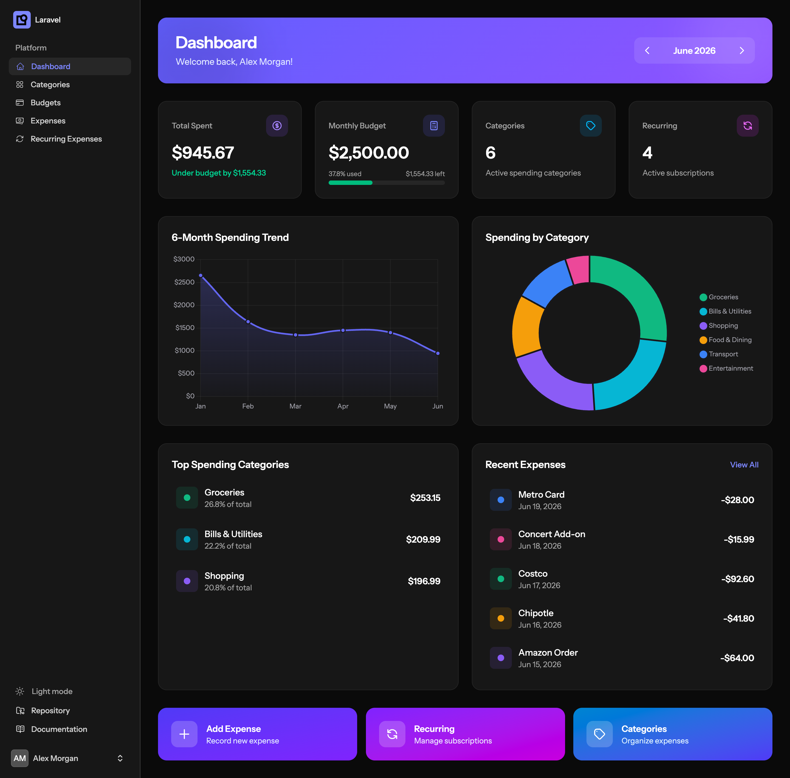
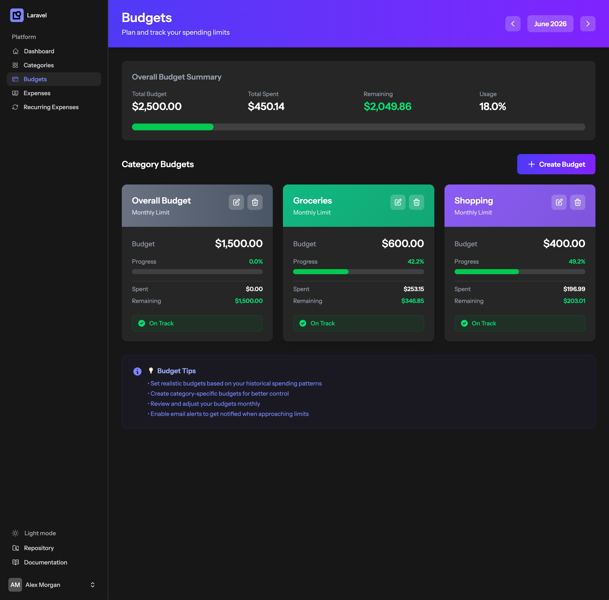
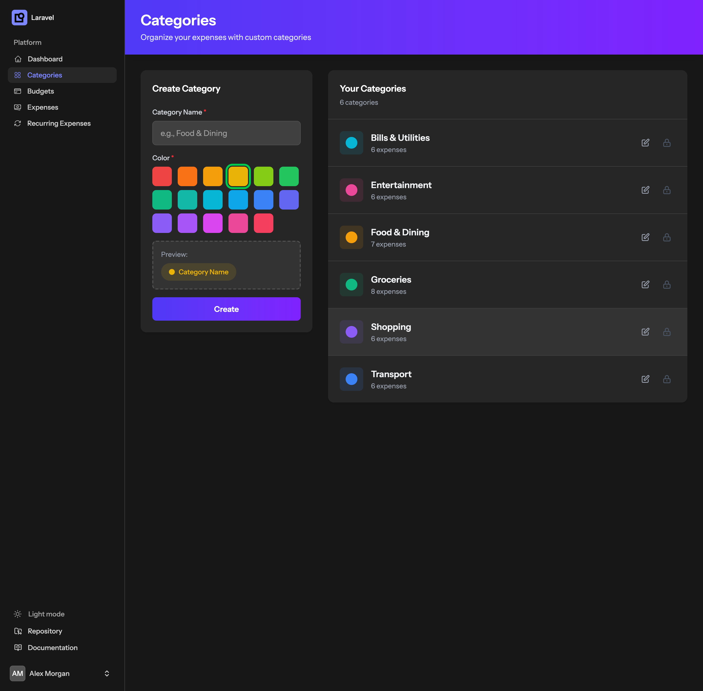
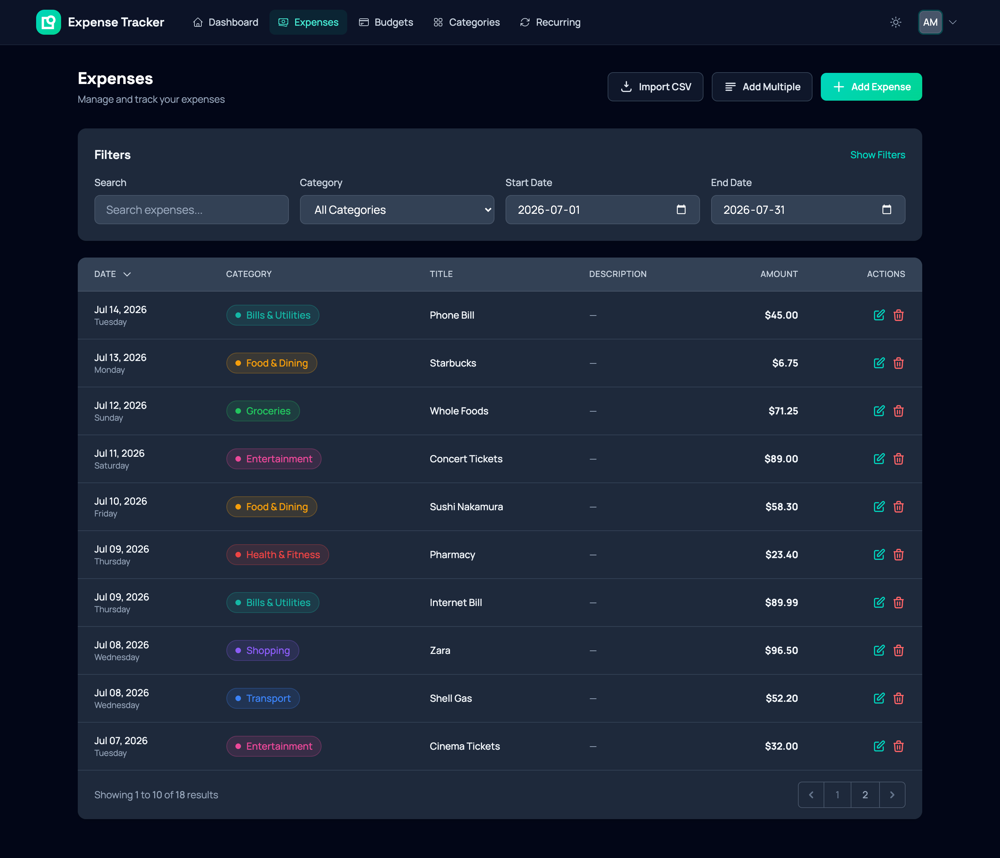
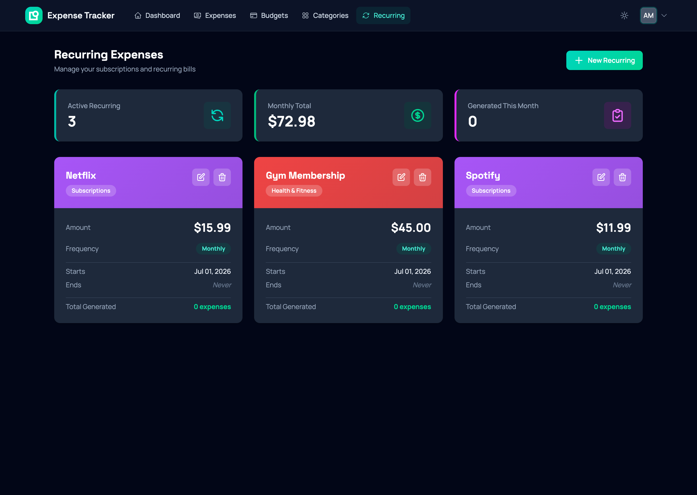

# 💰 Smart Expense Tracking App

A modern, full-stack expense tracking application built with the TALL stack (Tailwind CSS, Alpine.js, Laravel, Livewire) and integrated with Google Gemini AI for smart budget recommendations. Track one-time and recurring expenses, set budgets, import bank statements, and visualize your spending — all through a slick, real-time interface.

https://github.com/HuMangax/expense-tracking-application

*Developed based on the tutorial by [code with SJM](https://www.youtube.com/watch?v=KOHBYzDoGXU).*

---

## ✨ Features

* **📊 Interactive Dashboard:** Visualize your spending with charts and real-time statistics. Move between months and the spending trend and category breakdown update live — no page refresh.
* **🤖 AI Smart Recommendations:** Integrated with Google Gemini AI. The AI analyzes your previous 3 months of spending for a category and suggests realistic budget amounts (Conservative, Recommended, and Comfortable) with reasoning.
* **🧾 Bulk Expense Entry:** Add many one-time expenses at once on a single screen — a repeatable row grid with a live running total, saved together in one action.
* **📥 CSV Statement Import:** Import a CSV statement exported from your bank. A mapping wizard auto-detects the Date / Description / Amount columns (or separate debit / credit columns), previews the result, skips income and duplicate rows, then imports in one click. **No bank credentials are ever requested — you only upload the file you downloaded.**
* **🔁 Recurring Expenses:** Automate fixed expenses (e.g. subscriptions, rent) with customizable frequencies (daily, weekly, monthly, yearly).
* **🗂️ Custom Categories:** Organize budgets and expenses with custom, color-coded categories.
* **🎯 Budget Management:** Create overall and category-specific budgets, with visual progress bars tracking usage and remaining funds.
* **🔔 Email Notifications:** Automated alerts when spending exceeds your allocated budget.
* **🎨 Slick UI · Light & Dark:** A cohesive indigo → violet design with smooth, interactive micro-animations and a Light/Dark toggle (defaults to dark, remembers your choice). Fully responsive across mobile, tablet, and desktop.
* **🔐 Advanced Security:** Authentication with profile management, password updates, and Two-Factor Authentication (2FA), powered by Laravel Fortify.

---

## 🛠️ Tech Stack

This project uses the **TALL** stack with a few extras:

* **Framework:** Laravel 12 (PHP 8.2+)
* **Reactive Components:** Livewire 4 & Flux UI
* **JavaScript:** Alpine.js
* **Styling:** Tailwind CSS 4 (bundled with Vite)
* **Charts:** Chart.js
* **Database:** SQLite by default (MySQL / PostgreSQL also supported via `.env`)
* **Authentication:** Laravel Fortify (incl. 2FA)
* **AI Integration:** Google Gemini (`google-gemini-php/laravel`)

---

## 🚀 Getting Started

### Prerequisites
* PHP 8.2+
* Composer
* Node.js & npm

### Installation

```bash
# 1. Clone the repository
git clone https://github.com/HuMangax/expense-tracking-application.git
cd expense-tracking-application

# 2. Install dependencies
composer install
npm install

# 3. Set up your environment
cp .env.example .env
php artisan key:generate

# 4. Create the SQLite database and run migrations
touch database/database.sqlite
php artisan migrate
```

**(Optional) Enable AI budget recommendations** by adding your Google Gemini key to `.env`:

```env
GEMINI_API_KEY=your-key-here
```

### Running the Development Server

The app needs the Vite asset server and the Laravel server running together. Open two terminals in the project directory:

```bash
# Terminal 1 — frontend assets (Vite + hot reload)
npm run dev
```

```bash
# Terminal 2 — Laravel backend
php artisan serve
```

Visit **`http://127.0.0.1:8000`**, register an account, and you'll land straight on the dashboard.

> **Recurring expenses** are generated by a scheduled command (`expenses:generate-recurring-expense`). For it to run automatically, keep Laravel's scheduler running with `php artisan schedule:work` locally, or add a cron entry calling `php artisan schedule:run` in production.

---

## 📸 App Screenshots

<table>
  <tr>
    <td align="center"><b>Dashboard</b></td>
    <td align="center"><b>Budget Management</b></td>
  </tr>
  <tr>
    <td></td>
    <td></td>
  </tr>
  <tr>
    <td align="center"><b>Custom Categories</b></td>
    <td align="center"><b>Expense Tracking</b></td>
  </tr>
  <tr>
    <td></td>
    <td></td>
  </tr>
  <tr>
    <td align="center" colspan="2"><b>Recurring Subscriptions</b></td>
  </tr>
  <tr>
    <td align="center" colspan="2"></td>
  </tr>
</table>
